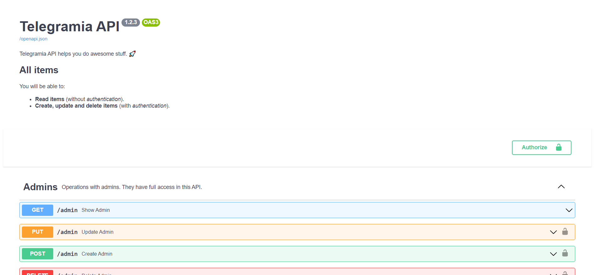

# Telegramia-API

## Overview

This site represents the RESTFul API of **Telegramia** data. Here you can find the documentation of all the available
methods. As unregistered users you can only get the information. But if you will be an administrator of the bot in the future, you can change the data with POST and PUT methods.

## Technical details

More about technical details read [here](technical.md).

## Screenshot



## How to use?

- For reading: just visit the site [here](https://telegramia-api.herokuapp.com/docs).
- For using: make requests in your language, for example in javascript:

```javascript
const axios = require('axios');

async function getCities() {
  try {
    const response = await axios.get('https://telegramia-api.herokuapp.com/cities');
    console.log(response.data);
  } catch (error) {
    console.error(error);
  }
}

console.log(getCities().data);
```

Response:

```json
[
  {
    _id: '61459129c55a7cbb8f7623ef',
    name: 'Брісвель',
    country: 'Пріаріа',
    is_capital: true,
    market: true,
    academy: true,
    temple: true,
    tavern: true,
    menagerie: true
  },
  {
    _id: '6246ba916e1fced7a92e4b4e',
    name: 'Вайфстел',
    country: 'Асмон',
    is_capital: true,
    market: true,
    academy: true,
    temple: true,
    tavern: true,
    menagerie: true
  },
  {
    _id: '6246baa46e1fced7a92e4b4f',
    name: 'Белсон',
    country: 'Браудал',
    is_capital: true,
    market: true,
    academy: true,
    temple: true,
    tavern: true,
    menagerie: true
  },
  {
    _id: '6246bab866f0553cc69d9bcc',
    name: 'Хоул Чиппинг',
    country: 'Естіл',
    is_capital: true,
    market: true,
    academy: true,
    temple: true,
    tavern: true,
    menagerie: true
  }
]
```


## License

[MIT license](https://github.com/mezidia/Telegramia/blob/main/LICENSE)

## Contacts

- [Author's Telegram](https://t.me/sylvenis)
