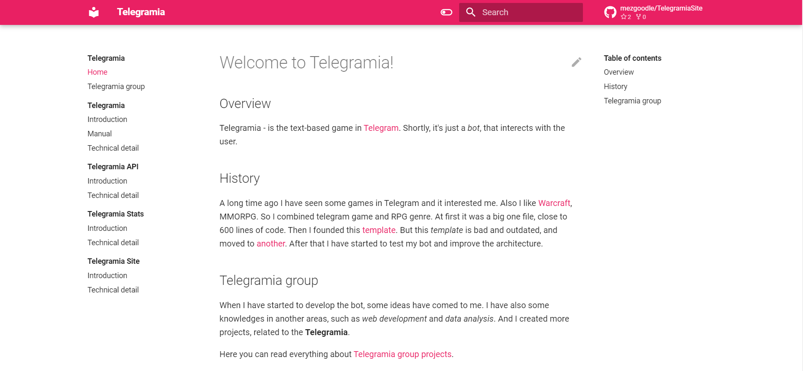

# TelegramiaSite

## Overview

On the site you can find all the documentation for the Telegramia group projects.
 
## Technical details

More about technical details read [here](technical.md).

## Screenshot

## How to use?

Just open the [link](https://mezgoodle.github.io/TelegramiaSite/).

## License

[MIT license](https://github.com/mezgoodle/Telegramia-API/blob/master/LICENSE)

## Contacts

- [Author's Telegram](https://t.me/sylvenis)
