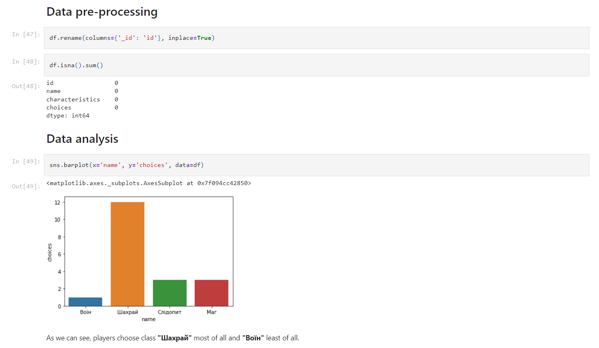

# TelegramiaStats

## Overview

On the second course in the university, I started to learn about the data analysis and visualization. I realized that I
could use the data from the Telegramia. For some users it can be useful or just interesting to see, for example, which raid is the most popular.

## Technical details

More about technical details read [here](technical.md).

## Screenshot

## How to use?

The result of the analysis you can see [here](https://github.com/mezgoodle/TelegramiaStats/blob/master/telegramia.ipynb) and for editing in **Google Colab** [here](https://colab.research.google.com/github/mezgoodle/TelegramiaStats/blob/master/telegramia.ipynb).

## License

[MIT license](https://github.com/mezgoodle/TelegramiaStats/blob/master/LICENSE)

## Contacts

- [Author's Telegram](https://t.me/sylvenis)
