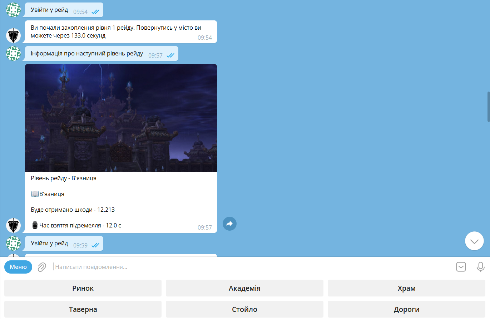

# Telegramia

## Overview

It's a text-based game in Telegram in RPG style. Here you can improve your character, fight monsters, and explore the
world. Now there is not any interaction with other players, but in the future there will be.

Game looks like a simple bot in Telegram. You can send commands to it and it will do the rest. So it's not difficult at
all to play.

## Technical details

More about technical details read [here](technical.md).

## Manual

Read the full manual [here](manual.md).

## Screenshot

## How to play?

Just open this [link](https://t.me/teliarpg_bot) and type `/start` command.

## License

[MIT license](https://github.com/mezidia/Telegramia/blob/main/LICENSE)

## Contacts

- [Author's Telegram](https://t.me/sylvenis)
