# How to play?

## Registration

### Step 1:

To register, you need to send a message to the bot with the command /create. You will receive a message with a keyboard with the country options.

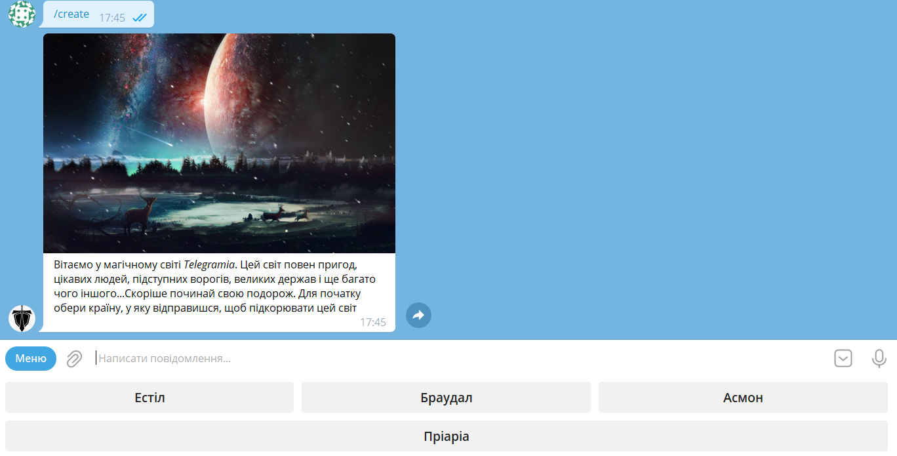

### Step 2:

Write your game nickname.

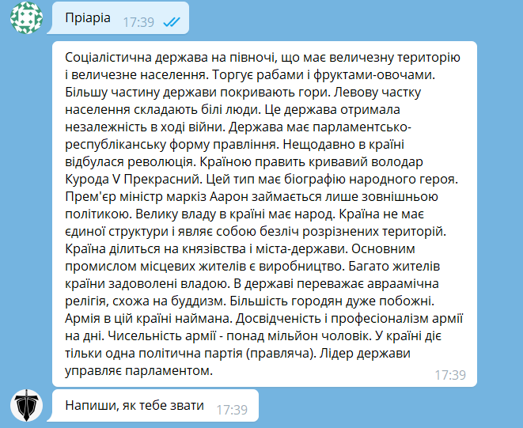

### Step 3:

Choose class for your character.

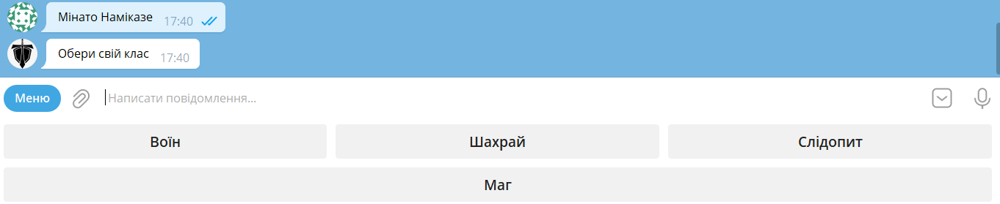

### Step 4:

Accept if you agree with your character.

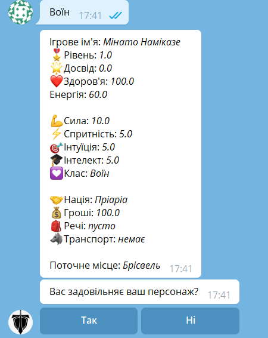

> If you don't agree with your character, you can change it.

### Summary:

After the registration, you will receive a message with information about the city where you are located.

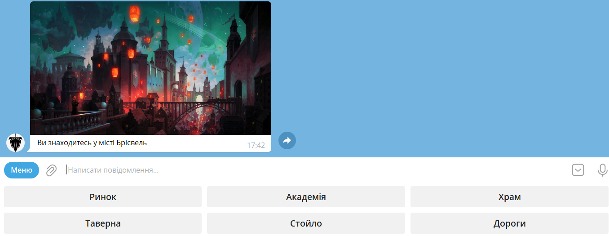

> You can delete your account at any time by sending a message to the bot with the command /delete.

## City

You can visit any city object by clicking the buttons in the keyboard. There you can increase your level, stats, buy items.

### Example

Visiting the market:

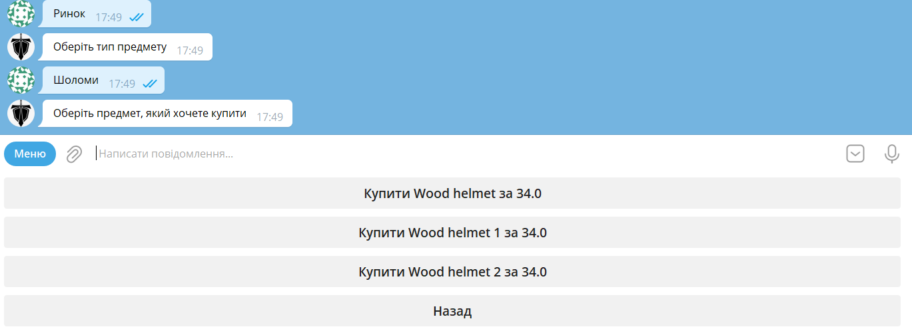

## Roads

Roads are the main way to go to other cities or objects. It takes your energy to travel, which you can restore in the tavern.

### Example

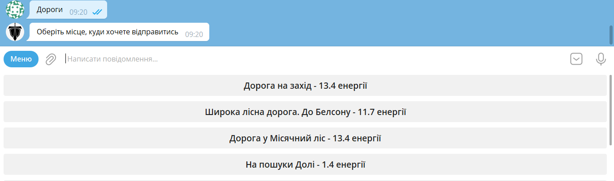

## Characteristics

There are four characteristics of your character: strength, agility, intelligence and intuition. As you can see on the image:

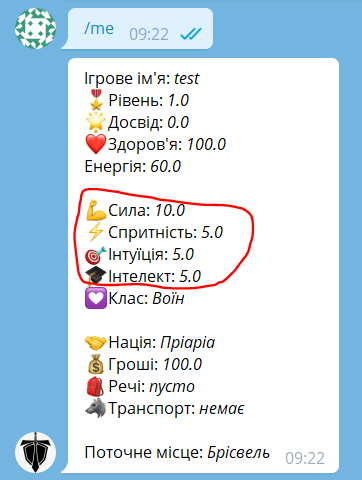

They are based on the class you have chosen and have limits on your level.

You can increase your characteristics by visiting different objects.

### Example

Increase your intelligence:

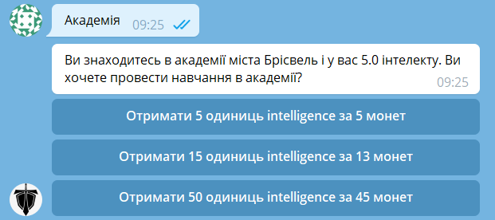

## Mounts

These horses are the main means of transportation. You can ride them to go to other cities or objects. In game logic, you spend less energy to travel. You can buy them in the menagerie.

### Example

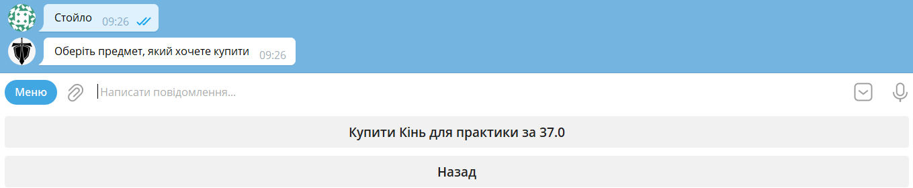

## Dungeons

This is the place where you can find the monsters. You can fight them and get rewards.

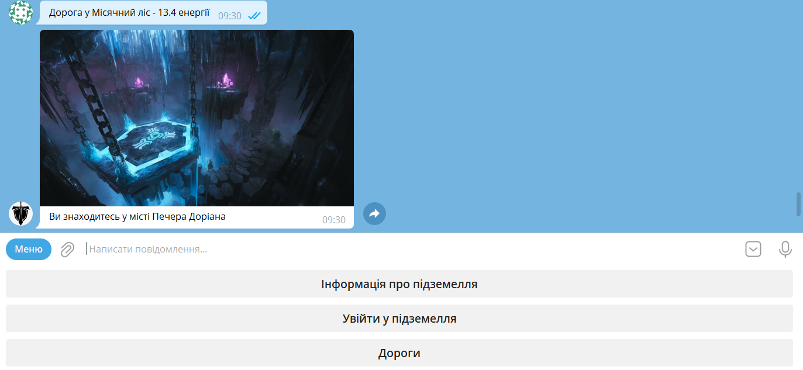

Here you can get the information about the dungeon, the rewards, the damage and how much time it needs to be completed.

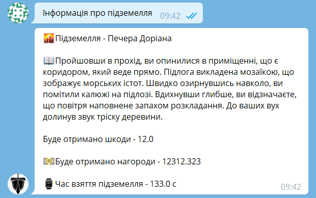

After entering the dungeon, you  need to wait the time to complete it. While you are in the dungeon, you cannot travel.

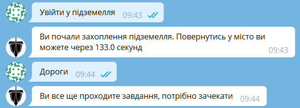

## Raids

Raids are similar to dungeons, but they are more difficult, because they have more levels to complete.

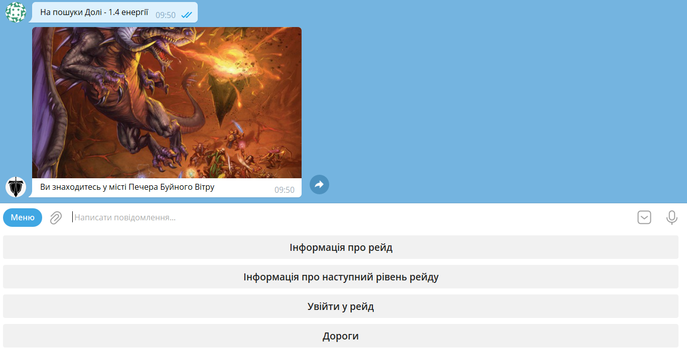

Here you can also get the information about the raid, the rewards, the damage and how much time it needs to be completed.
